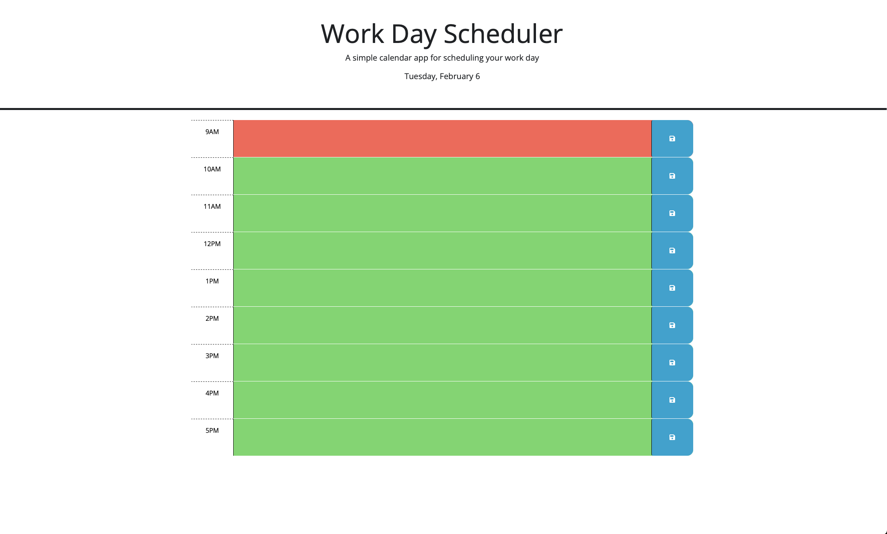

# workDay-scheduler

## Description

This project revolves around the development of a workday calendar application using JavaScript and the third-party API Day.js. Its focus is to provide users with a detailed hourly breakdown of their day from 9 am to 5 pm. The application allows users to efficiently input, save, and reference tasks for each hour, promoting effective daily scheduling. To enhance user experience, the page dynamically displays the current date and utilizes a color-coded hourly breakdown, distinguishing between past, present, and future hours. The criterias that needed to be addressed:  

    C1. Current date will be displayed at top of page 
    C2. Time block is set 9am - 5pm  
    C3. Time blocks are color codded based on relation to actual time
    C4. Users can create event in timeblock
    C5. Users can save events in local storage 
    C6. Saved data will persist 

Utilizing APIs broadens the range of applications developers can build. APIs play a crucial role for modern web applications as they facilitate communication, and improve readability and efficency. APIs provide a standardized way for developers to access the functionality or data of a service, library, or platform. This project showcases the effective use of third-party APIs, specifically Day.js, to create a dynamic workday calendar application.

# Deployed Web Application
### [Work Day Scheduler](https://margauxjenica.github.io/workDay-scheduler/)

# Final Product
## Color Blocked Schedule:

## Saving Data to Local Storage:

## Persistent Data:

